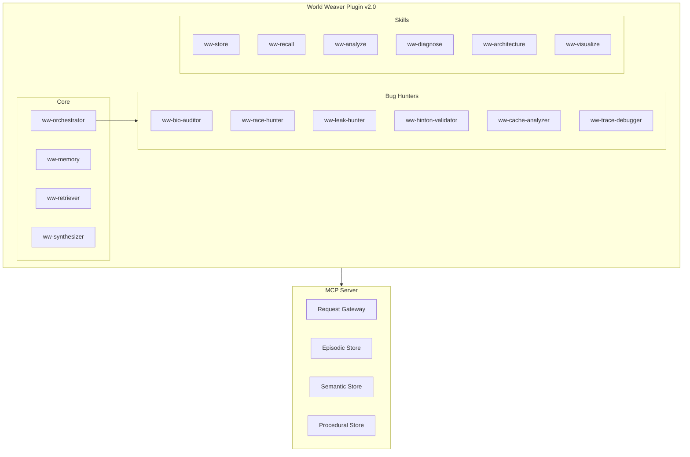

# World Weaver Plugin v2.0


Bio-inspired neural memory system for Claude Code with analysis, diagnosis, and documentation capabilities.

## What's New in v2.0

- **6 Bug-Hunting Agents**: Specialized agents grounded in Hinton's learning theory
- **4 New Skills**: Analysis, diagnosis, architecture, and visualization
- **4 New Commands**: /ww-audit, /ww-diagnose, /ww-visualize, /ww-stats
- **Workflow Orchestration**: Multi-agent coordination for comprehensive analysis
- **Biological Plausibility Validation**: CLS, STDP, eligibility traces, neuromodulation

## Features

### Memory System
- **Episodic Memory**: Fast learning autobiographical events
- **Semantic Memory**: Slow learning knowledge graph with Hebbian strengthening
- **Procedural Memory**: Skills and patterns with success tracking
- **Automatic Capture**: Hooks store memories without manual intervention

### Analysis & Diagnosis
- **Bug Hunting**: 6 specialized agents for different bug categories
- **Root Cause Analysis**: Diagnostic workflows for common issues
- **Architecture Documentation**: Auto-generated from code
- **Visualizations**: Knowledge graphs, timelines, architecture diagrams

## Requirements

- Claude Code CLI
- World Weaver MCP server (`ww-memory`)
- Neo4j database (for graph storage)
- Qdrant database (for vector storage)

## Quick Start

### Commands

```bash
# Memory Operations
/remember Fixed the authentication bug  # Store episode
/recall authentication bug              # Search memories
/consolidate                            # Trigger consolidation

# Analysis & Diagnosis
/ww-audit                               # Full system audit
/ww-audit learning                      # Audit learning code
/ww-diagnose learning                   # Diagnose learning issues
/ww-stats                               # Show statistics
/ww-visualize graph                     # Show knowledge graph
```

## Agents

### Core Agents
| Agent | Description |
|-------|-------------|
| `ww-memory` | Direct memory interface |
| `ww-retriever` | Multi-strategy retrieval |
| `ww-synthesizer` | Cross-memory synthesis |
| `ww-orchestrator` | Workflow coordination |

### Bug-Hunting Agents
| Agent | Description | Bug Types |
|-------|-------------|-----------|
| `ww-bio-auditor` | Biological plausibility | CLS, plasticity, neuromodulation |
| `ww-race-hunter` | Concurrency bugs | TOCTOU, deadlocks, async state |
| `ww-leak-hunter` | Resource exhaustion | Memory leaks, unbounded growth |
| `ww-hinton-validator` | Learning theory | FF, GLOM, Hopfield, sparsity |
| `ww-cache-analyzer` | Cache issues | Staleness, stampede, poisoning |
| `ww-trace-debugger` | Temporal credit | Eligibility traces, decay |

## Skills

| Skill | Purpose |
|-------|---------|
| `ww-store` | Store episodes, entities, skills |
| `ww-recall` | Multi-strategy retrieval |
| `ww-context` | Build context from memories |
| `ww-consolidate` | Trigger memory consolidation |
| `ww-analyze` | Deep analysis workflows |
| `ww-diagnose` | Problem diagnosis |
| `ww-architecture` | Documentation generation |
| `ww-visualize` | Memory visualization |

## Architecture



## Workflows

### Full System Audit

```bash
/ww-audit all
```

Runs all 6 bug hunters in parallel:
1. **Phase 1 - Learning**: bio-auditor, hinton-validator, trace-debugger
2. **Phase 2 - Concurrency**: race-hunter, leak-hunter, cache-analyzer
3. **Phase 3 - Merge**: Consolidate findings, generate report

### Diagnostic Flow

```bash
/ww-diagnose learning
```

1. Quick health check (services, connections)
2. Run symptom-specific agents
3. Identify root cause
4. Provide fix recommendation

## Theoretical Foundations

### Hinton's Principles
- **Forward-Forward Algorithm**: Layer-local learning via goodness functions
- **GLOM**: Part-whole hierarchies through islands of agreement
- **Modern Hopfield**: Exponential capacity associative memory
- **Biological Plausibility**: Local learning rules, no weight transport

### Neuroscience
- **Complementary Learning Systems**: Fast episodic + slow semantic
- **Three-Factor Learning**: ΔW = η × activity × eligibility × neuromodulator
- **Eligibility Traces**: TD(λ) temporal credit assignment
- **Neuromodulation**: DA (reward), NE (novelty), ACh (encoding), 5-HT (patience)

## Configuration

```json
{
  "audit": {
    "outputPath": "/home/aaron/mem/",
    "defaultScope": "all",
    "parallelAgents": true
  },
  "visualization": {
    "defaultFormat": "mermaid",
    "maxNodes": 50,
    "minWeight": 0.3
  }
}
```

## Installation

### 1. Install World Weaver Package

```bash
cd ~/ww
pip install -e ".[dev]"
```

### 2. Start Required Services

```bash
# Neo4j
docker run -d --name neo4j \
  -p 7474:7474 -p 7687:7687 \
  -e NEO4J_AUTH=neo4j/wwpassword \
  neo4j:latest

# Qdrant
docker run -d --name qdrant \
  -p 6333:6333 \
  qdrant/qdrant:latest
```

### 3. Configure Claude Code

Add to `~/.claude/settings.json`:

```json
{
  "mcpServers": {
    "ww-memory": {
      "command": "python",
      "args": ["-m", "ww.mcp.server"],
      "env": {
        "NEO4J_URI": "bolt://localhost:7687",
        "NEO4J_USER": "neo4j",
        "NEO4J_PASSWORD": "wwpassword",
        "QDRANT_HOST": "localhost",
        "QDRANT_PORT": "6333"
      }
    }
  }
}
```

### 4. Enable Plugin

```bash
ln -s ~/github/astoreyai/claude-skills/skills/memory/world-weaver \
      ~/.claude/skills/world-weaver
```

## Changelog

### v2.0.0 (2025-12-08)
- Added 6 bug-hunting agents grounded in Hinton's learning theory
- Added analysis, diagnosis, architecture, and visualization skills
- Added audit, diagnose, visualize, and stats commands
- Added workflow orchestration with ww-orchestrator
- Added agent categories and predefined workflows
- Updated plugin structure for engineering-focused analysis

### v1.1.0
- Added kymera-voice integration
- Improved session hooks

### v1.0.0
- Initial release with core memory functionality

## License

MIT

## Related

- [World Weaver Repository](https://github.com/astoreyai/world-weaver)
- [Hinton (2022) "The Forward-Forward Algorithm"](https://arxiv.org/abs/2212.13345)
- [McClelland et al. (1995) "Complementary Learning Systems"](https://www.ncbi.nlm.nih.gov/pmc/articles/PMC1351070/)
