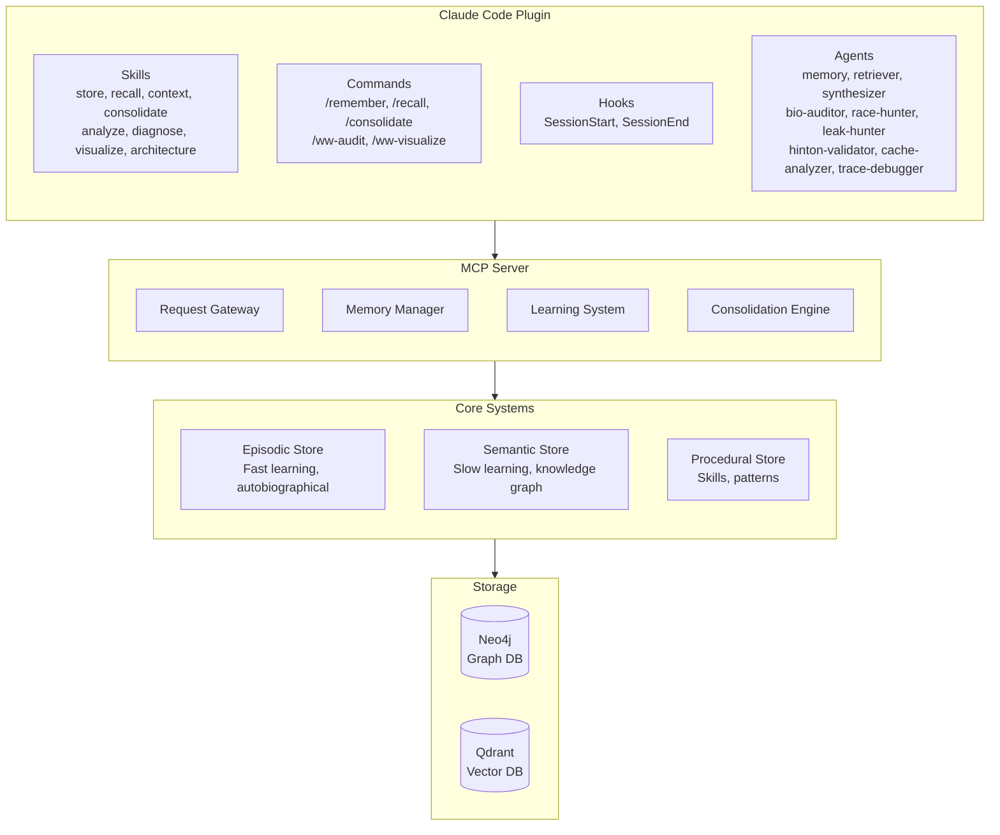
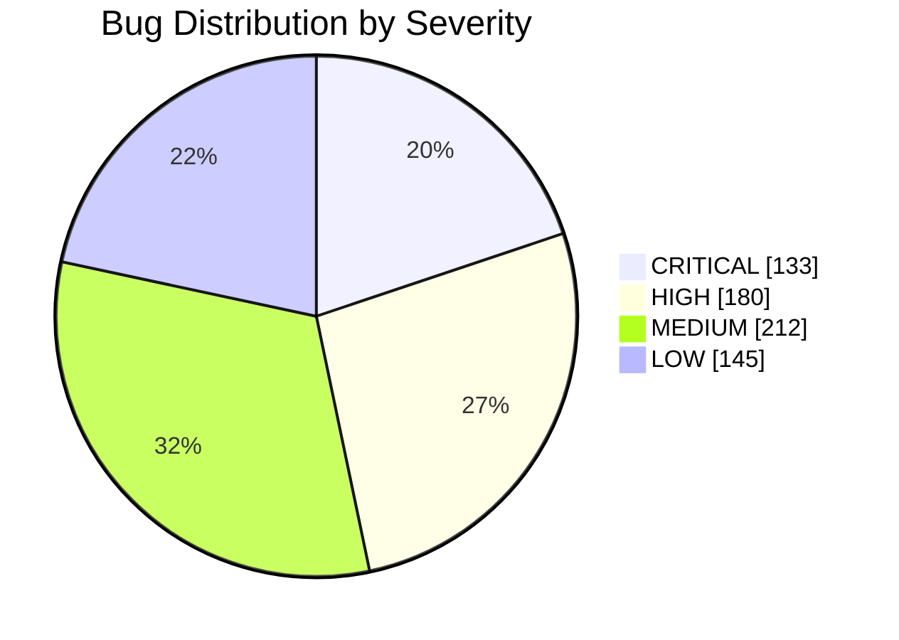
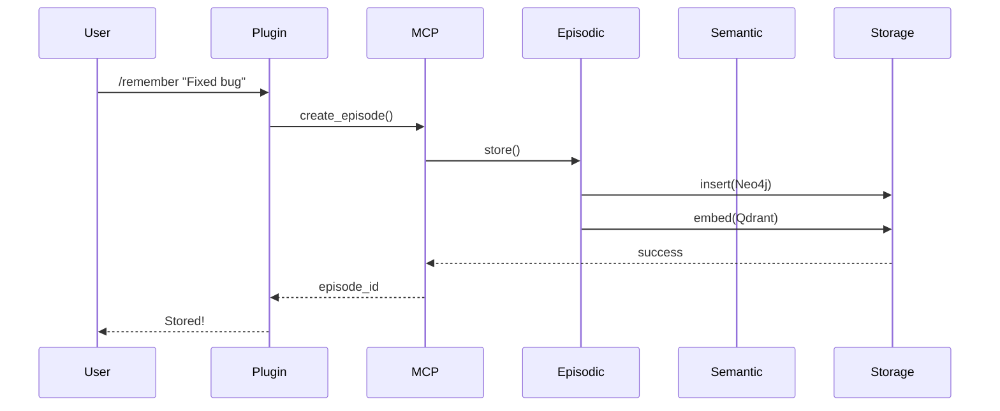

# WW Visualize Skill

Memory visualization and diagramming for World Weaver systems.

## Purpose

This skill provides visualization capabilities:
1. **Memory Graphs**: Visualize knowledge graph structure
2. **Timeline Views**: Show memory evolution over time
3. **Architecture Diagrams**: System component diagrams
4. **Analysis Charts**: Bug distributions, metrics
5. **Learning Curves**: Training progress visualization

## When to Use

Invoke this skill when:
- User asks "show me the memory graph"
- User asks "visualize the architecture"
- User wants to see memory patterns
- Analysis results need visualization
- Documentation needs diagrams

## Visualization Types

### 1. Knowledge Graph Visualization

Generate Mermaid diagram of entity relationships:

```python
def generate_knowledge_graph(entities, relationships):
    """Generate Mermaid graph from WW semantic memory."""
    lines = ["graph LR"]

    # Add entities
    for entity in entities:
        node_id = entity['name'].replace(' ', '_')
        lines.append(f"    {node_id}[{entity['name']}]")

    # Add relationships
    for rel in relationships:
        src = rel['source'].replace(' ', '_')
        tgt = rel['target'].replace(' ', '_')
        label = rel['type']
        weight = rel.get('weight', 1.0)

        # Thicker line for stronger relationships
        if weight > 0.7:
            lines.append(f"    {src} =={label}==> {tgt}")
        else:
            lines.append(f"    {src} --{label}--> {tgt}")

    return '\n'.join(lines)
```

Output:


### 2. Memory Timeline

Generate timeline of episodes:

```python
def generate_timeline(episodes):
    """Generate Mermaid timeline from episodes."""
    lines = ["gantt", "    title Memory Timeline", "    dateFormat YYYY-MM-DD"]

    # Group by project
    by_project = defaultdict(list)
    for ep in episodes:
        project = ep.get('context', {}).get('project', 'Unknown')
        by_project[project].append(ep)

    for project, eps in by_project.items():
        lines.append(f"    section {project}")
        for ep in eps:
            date = ep['timestamp'][:10]
            outcome = ep['outcome']
            icon = "crit" if outcome == "failure" else ""
            lines.append(f"    {ep['content'][:30]} :{icon} {date}, 1d")

    return '\n'.join(lines)
```

### 3. Architecture Component Diagram



### 4. Bug Distribution Chart

```python
def generate_bug_chart(bugs):
    """Generate bug distribution visualization."""
    by_severity = defaultdict(int)
    by_type = defaultdict(int)

    for bug in bugs:
        by_severity[bug['severity']] += 1
        by_type[bug['type']] += 1

    # Mermaid pie chart
    lines = ["pie showData", "    title Bug Distribution by Severity"]
    for severity, count in by_severity.items():
        lines.append(f'    "{severity}" : {count}')

    return '\n'.join(lines)
```



### 5. Learning Progress

```python
def generate_learning_curve(metrics):
    """Generate learning progress chart."""
    lines = [
        "xychart-beta",
        "    title Learning Progress",
        '    x-axis ["Step 1", "Step 2", "Step 3", "Step 4", "Step 5"]',
        f'    y-axis "Loss" 0 --> 1',
        f'    line [{", ".join(str(m["loss"]) for m in metrics)}]'
    ]
    return '\n'.join(lines)
```

### 6. Memory System Flow



## Output Formats

Visualizations can be generated as:
1. **Mermaid** - For markdown embedding
2. **ASCII** - For terminal display
3. **JSON** - For web rendering
4. **DOT** - For Graphviz

## Commands

```bash
# Generate knowledge graph
/ww-visualize graph --limit 50 --min-weight 0.3

# Generate timeline
/ww-visualize timeline --days 7

# Generate architecture
/ww-visualize architecture

# Generate bug chart
/ww-visualize bugs --from /home/aaron/mem/MASTER_BUG_LIST.md
```

## Integration

This skill integrates with:
- **ww-analyze**: Visualize analysis results
- **ww-diagnose**: Show diagnostic flowcharts
- **ww-architecture**: Embed in documentation
- **MCP server**: Query memory data

## Output Locations

Generated visualizations:
- `/home/aaron/mem/WW_GRAPH_{timestamp}.md` - Knowledge graphs
- `/home/aaron/mem/WW_TIMELINE_{timestamp}.md` - Timelines
- `/home/aaron/mem/WW_ARCHITECTURE_{timestamp}.md` - Architecture
- `/home/aaron/ww/docs/diagrams/` - Persistent diagrams

## Error Handling

If visualization fails:
1. Check data availability
2. Fall back to simpler visualization
3. Provide raw data if rendering fails
4. Log error with context
